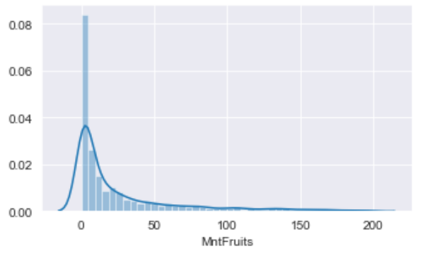
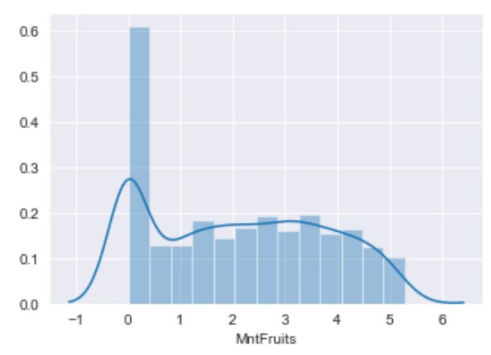
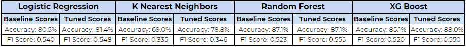
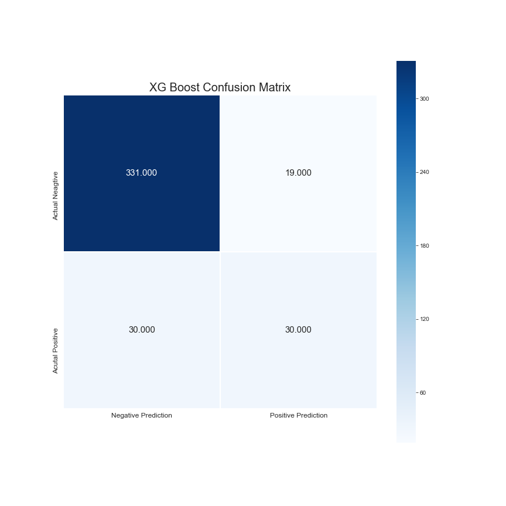
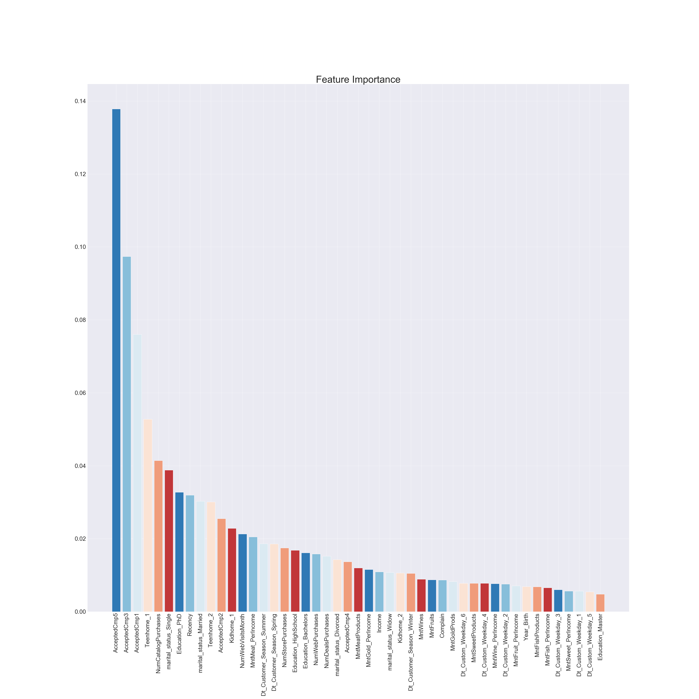

# DS Mod 3 Project
Predicting whether customers of a retail food company would or wouldn't be converted on the final campaign using data provided by [Rodolfo Saldanha](https://www.kaggle.com/rodsaldanha/arketing-campaign#ml_project1_data.xlsx) on Kaggle.

## Methodology
* Target: Response i.e. whether or not customer was converted on final campaign. Either a 1 for yes or 0 for no.
* Features: birth year, education level, maritial status, annual income, number of children and teenagers in the home, number of days since last purchase (recency), amount spent on several different types of products over past two years, number of purchases through different channels, whether or not they were converted on five previous campaigns.

## Challenges
* Massive class imbalance: only about 12.5% of dataset had response of 1
* Not real data: This set was clearly created by a user and there were some inconsistencies and confusing aspects that needed to be cleaned.
    * Additionally, I couldn't use any domain knowledge or perform any research to gain more intuition on the data because of this.
* Large amount of variance, skewness and zero values in continuous features

## Exploratory Data Analysis
* No features had a strong correlation with the target, but conversions on previous campaigns were the strongest

## Feature Engineering
* Used log transformations on skewed data to rein it in, but wasn't able to account for zero values, which made up about 50% of the data as seen below. Later excluded some, which took it down to 35%.

| Pre-Transformation | Post-Transformation |
| -------- | -------- |
| | |
* Created spends on different categories as proportions of income
* Created dummy variables for all categorical and discrete data
* Ultimately had 47 features

## Model Building
* Before actually using any models, data was scaled using the Min Max Scaler and target was oversampled on training using SMOTE method.
* Also tested out creating polynomial features, but having over 1200 vs. 47 actually didn't really make any difference, just a lot more complexity
    * Select k best was used to reduce the number, but ultimately excluded since I found that it didn't help the models
* Dummy classifier set baseline accuracy at 85%, demonstrating the massive class imbalance to be working against
* Created baselines for four different algorithms and tuned using randomized search

 

## Conclusions
* Ultimately decided on the XG Boost as my final, improving accuracy by a whopping 3%!
* A major caveat for this model is that there is a potential for overfitting as the training data was predicted almost perfectly (99.6% accuracy, 0.996 F1 Score), but this could be due to the class imbalance as well
* All models including XG Boost seemed to perform quite well on the negative outcomes, but was only able to correctly predict positive ones about 3 out of 5 times as you can see in the confusion matrix
 
* Previous acceptances on other campaigns were most signficant indicators of whether they were converted on the final campaign or not confirming suspsicions from EDA as seen in the below chart of feature improtances
 

## Next Steps
* Models seemed to be rather complex. Would experiment further with trimming as parameters like max depth and number of estimators seemed high
* Examine correlation between features more deeply to see if there were any redundancies I could have accounted for
* Dive deeper into the potential of overfitting. Just dropping features proportionally made both the training and testing scores worse, and did not make them more even
* Experiment more with different versions of the dataset i.e. no transformations, no exclusions of zero values
* Find a way to further acount for said 0 values
