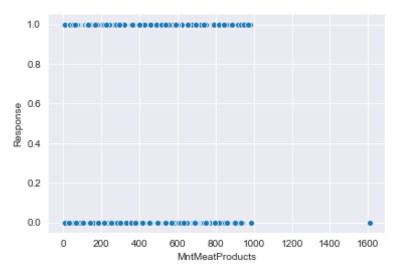
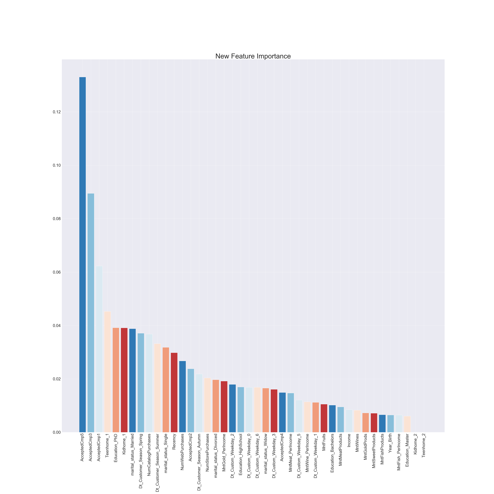

# DS Mod 3 Project
Predicting whether customers of a retail food company would or wouldn't be converted on the final campaign using data provided by [Rodolfo Saldanha](https://www.kaggle.com/rodsaldanha/arketing-campaign#ml_project1_data.xlsx) on Kaggle.

## Overall Findings
* XG Boost Classifier performed best with final model having 89.27% accuracy and F1 score of .60
* Initial final model was overly complex and through second round of EDA and visualizations of each hyperparameter, it was simplified and performance improved
* Potential for overfitting still exists and with more time, I would try to examine more deeply

## Methodology
* Data set was approximately 2,000 records with 29 columns, several of which were simply identifiers, a single variable for its entirety (e.g. one entitled Z_CostContact just had the value 3) or superfluous
    * A relatively small set was chosen to be able to quickly process and focus on the practice EDA, feature engineering and machine learning model building rather than simply waiting for algorithms to run
* Target: Response i.e. whether or not customer was converted on final campaign. Either a 1 for yes or 0 for no.
* Features: birth year, education level, maritial status, annual income, number of children and teenagers in the home, number of days since last purchase (recency), amount spent on several different types of products over past two years, number of purchases through different channels, whether or not they were converted on five previous campaigns.

## Challenges
* Massive class imbalance: only about 12.5% of dataset had response of 1
* Not real data: This set was clearly created by a user and there were some inconsistencies and confusing aspects that needed to be cleaned.
    * Additionally, I couldn't use any domain knowledge or perform any research to gain more intuition on the data because of this.
* Large amount of variance, skewness and zero values in continuous features

## Exploratory Data Analysis
* No features had a strong correlation with the target, but conversions on previous campaigns were the strongest as well as amount spent on certain product categories and number of catalog purchases

| Feature | Correlation Coefficient |
| -------- | -------- |
| AcceptedCmp5 | 0.327644 |
| AcceptedCmp1 | 0.294834 |
| AcceptedCmp3 | 0.252882 |
| MntMeatProducts | 0.251877 |
| MntWines | 0.247467 |
| NumCatalogPurchases | 0.241731 |
* Additionally features did not highly correlate with each other
* Scatter plots of features against target didn't reveal much either, even for the top ones according to the correlation matrix

Scatter Example 1           |  Scatter Example 2
:-------------------------:|:-------------------------:
  | 
* Distribution and box plots further uncovered variance and skewness in the data, which was worked on in the feature engineering stage

## Feature Engineering
* Used log transformations on skewed data to rein it in, but wasn't able to account for zero values, which made up about 50% of the data as seen below. Later excluded some, which took it down to 35%.

| Pre-Transformation | Post-Transformation |
| -------- | -------- |
| | |
* Created spends on different categories as proportions of income
* Created dummy variables for all categorical and discrete data
* Ultimately had 47 features

## Model Building
* Before actually using any models, data was scaled using the Min Max Scaler and target was oversampled on training using SMOTE method.
* Also tested out creating polynomial features, but having over 1200 vs. 47 actually didn't really make any difference, just a lot more complexity
    * Select k best was used to reduce the number, but ultimately excluded since I found that it didn't help the models
* Dummy classifier set baseline accuracy at 85%, demonstrating the massive class imbalance to be working against
* Created baselines for four different algorithms and tuned using randomized search

 

## Conclusions
* Ultimately decided on the XG Boost as my final, improving accuracy by a whopping 3%!
* A major caveat for this model is that there is a potential for overfitting as the training data was predicted almost perfectly (99.6% accuracy, 0.996 F1 Score), but this could be due to the class imbalance as well
* All models including XG Boost seemed to perform quite well on the negative outcomes, but was only able to correctly predict positive ones about 3 out of 5 times as you can see in the confusion matrix
 
* Previous acceptances on other campaigns were most signficant indicators of whether they were converted on the final campaign or not confirming suspsicions from EDA as seen in the below chart of feature improtances
 

# Reevaluation

## EDA Round 2
* Noticed the final model was rather complex so I decided to go back, do more EDA to if there were any more relationships I could find and features I could potentially remove
* After reexamining correlation between features and target as well as examining count plots and distributions and descriptive statistics of all features based on response, I removed five to reduce the number of dimensions to 42 from 47
 
 
* The above count plot clearly shows there's a relationship between being single and whether or not you were converted on the campaign
* The above distribution shows that those who were converted on the final campaign spent more on meat products, which was indicated by the correlation metrics and confirmed by descriptive statistics

## XG Boost Modeling Round 2
* As mentioned above, since I was uncomfortable with leaving the model as complex as it was I decided to dive deep into each hyperparameter to see what I could glean
* In order to do this I visualized each one on the training and test data vs. my main metric of success in accuracy. Through this I found both the parameter that had the most positive effect on performance as well as a way to massively simplify the model while still improving upon the 'best' one that RandomizedSearch gave me

* The above is an example of one of those parameters, number of estimators, with training on the left and test on the right. Initially I had been using 1,500 as my initial number, but through this reduced it to 200
* Additionally, I was able to figure out that max depth i.e. the number of levels this algorithm would go down in building a tree, was the one that had the best effect on accuracy

## Conclusions Round 2
* After all was said and done I was able to improve the accuracy to 89.27% and F1 to .60 (up from 87.5% and .52 after feature reduction)
    * Additionally, had I kept the number of features to 47, accuracy improved to 89.56% and F1 to .63 (up from 88.0% and .55 as seen in the model comparison chart earlier)
* True positives and true negatives slighlty improved as indicated by the confusion matrix on the new final model

* The most important features were largely the same and indicate two that were essentially zeroed out, meaning the model was ultimately built on 40 not 42

* Overall I am significantly more comfortable with this model than I was with the previous due to its simpler nature and lower dimensionality

## Potential Next Steps
* Dive more deeply into the potential of overfitting. Just dropping features proportionally made both the training and testing scores worse, and did not make them more even
* Experiment more with different versions of the dataset i.e. no transformations, no exclusions of zero values
* Find a way to further acount for 0 values
